```markdown
# 🏠 Home Services App

> **Your One-Stop Solution for All Home Service Needs**

A modern, feature-rich Flutter application that connects users with professional home service providers. Built with clean architecture, BLoC/Cubit state management, and a stunning dark/light theme experience.

---
## 📱 Screenshots

<div align="center">
  <table>
    <tr>
      <td align="center"><b>Home Screen</b></td>
      <td align="center"><b>Search Bar</b></td>
      <td align="center"><b>Search Results</b></td>
    </tr>
    <tr>
      <td>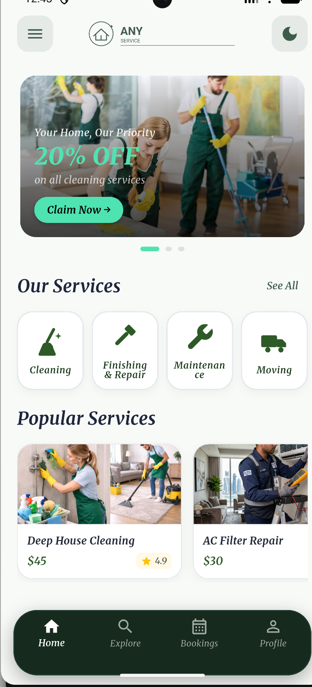</td>
      <td>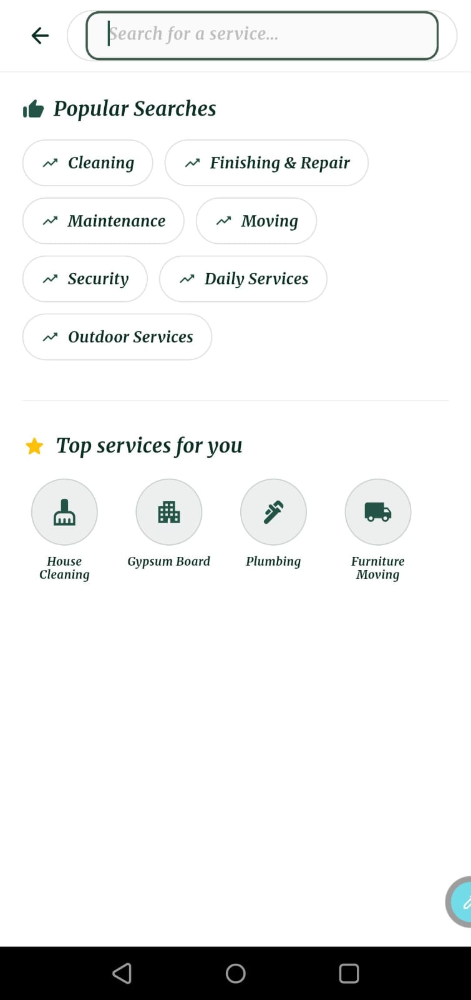</td>
      <td>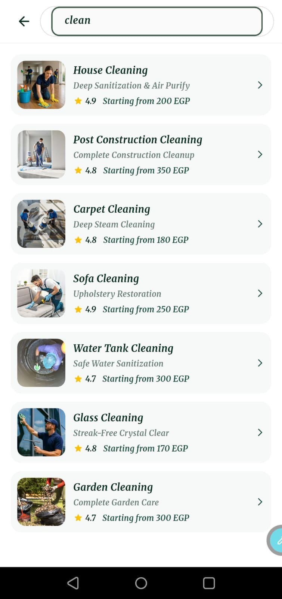</td>
    </tr>
    <tr>
      <td align="center"><b>Service Details</b></td>
      <td align="center"><b>Login Required</b></td>
      <td align="center"><b>Create Account</b></td>
    </tr>
    <tr>
      <td>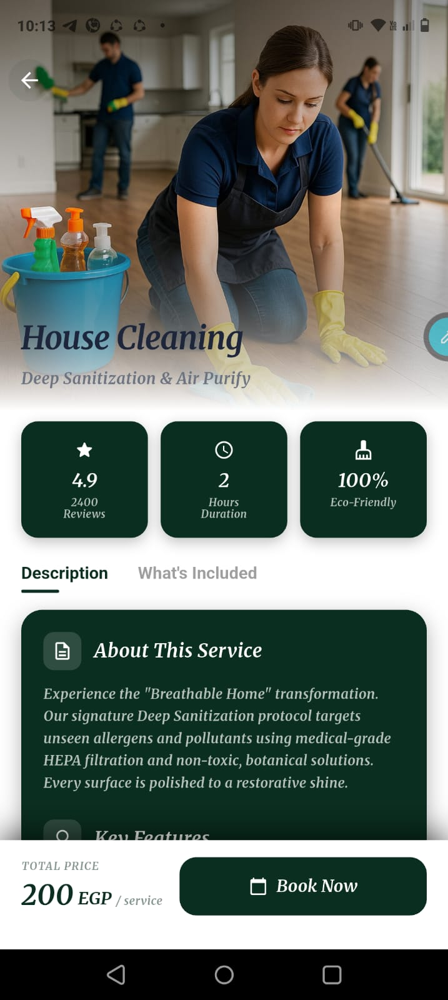</td>
      <td>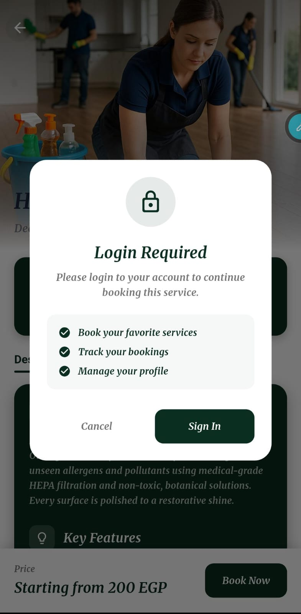</td>
      <td>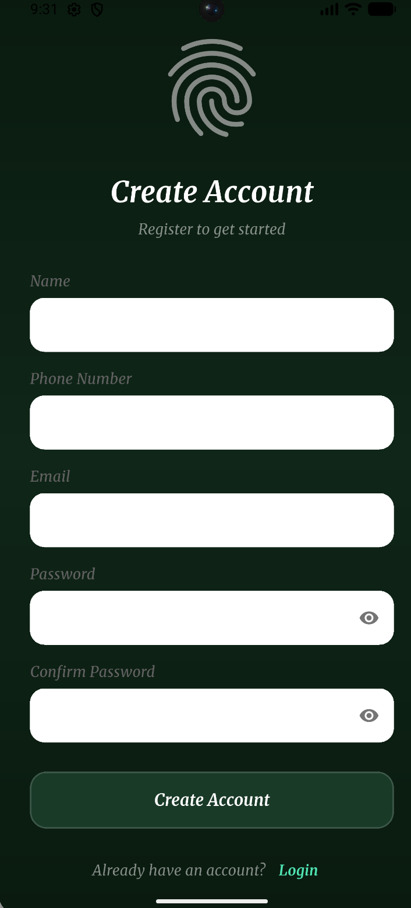</td>
    </tr>
    <tr>
      <td align="center"><b>Logged In</b></td>
      <td align="center"><b>Booking Screen</b></td>
      <td align="center"><b>Select Worker</b></td>
    </tr>
    <tr>
      <td>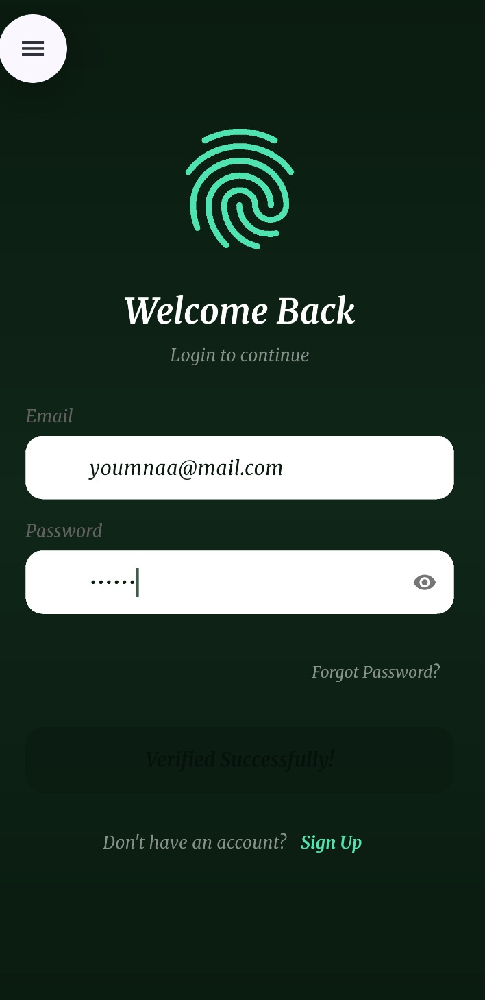</td>
      <td>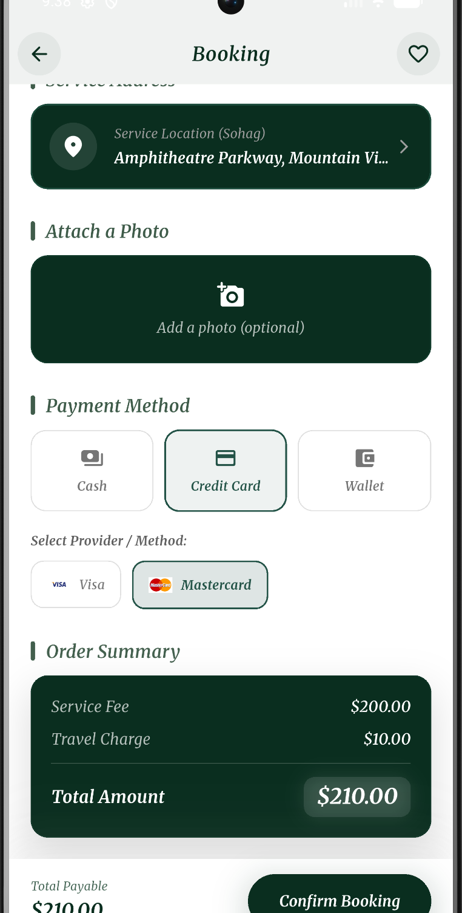</td>
      <td>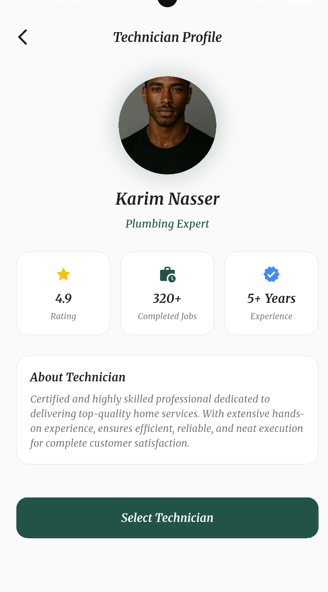</td>
    </tr>
    <tr>
      <td align="center"><b>Set Location</b></td>
      <td align="center"><b>Pick Time</b></td>
      <td align="center"><b>Confirm Booking</b></td>
    </tr>
    <tr>
      <td>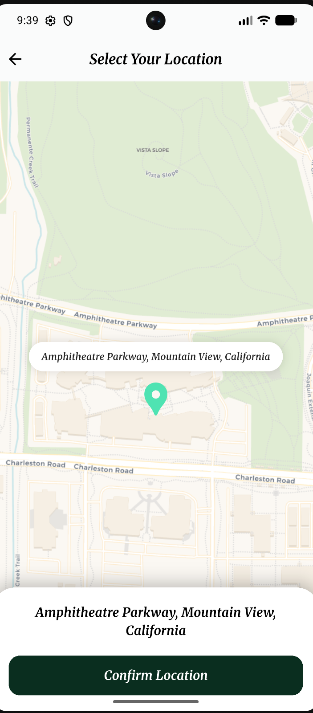</td>
      <td>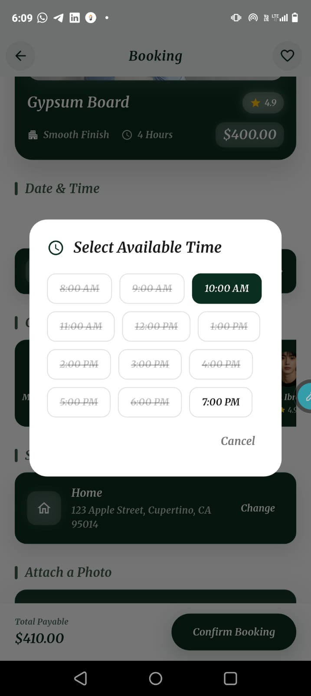</td>
      <td>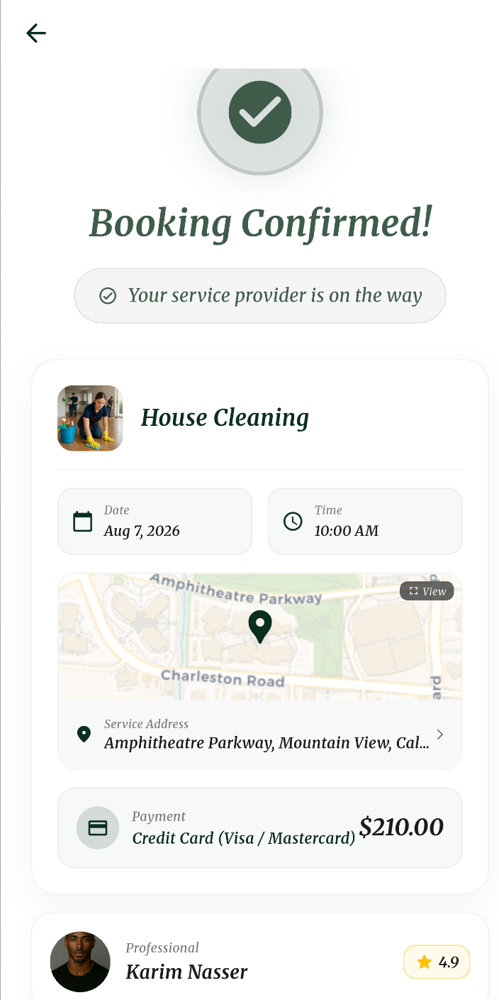</td>
    </tr>
    <tr>
      <td align="center"><b>My Bookings</b></td>
      <td align="center"><b>Cancel Dialog</b></td>
      <td align="center"><b>Rating Dialog</b></td>
    </tr>
    <tr>
      <td>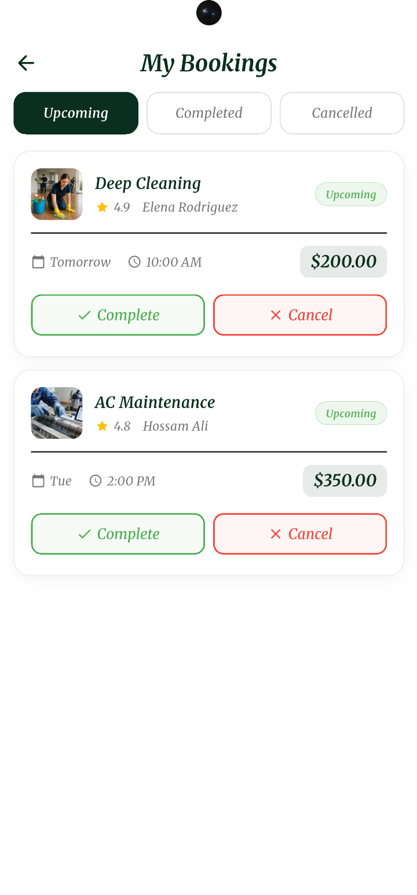</td>
      <td>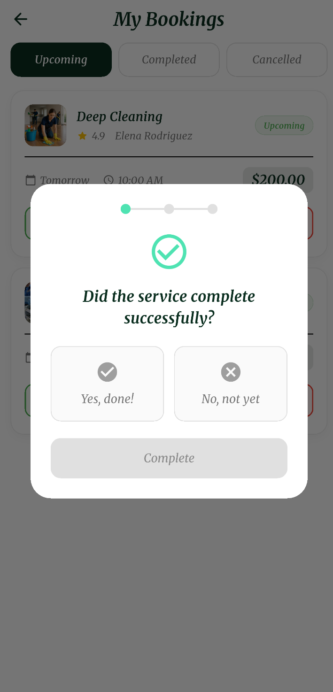</td>
      <td>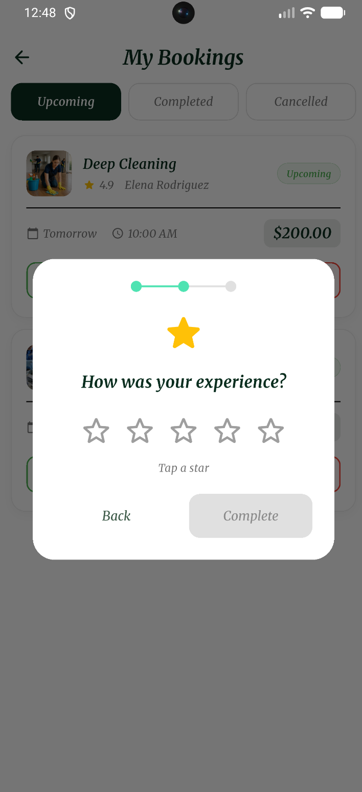</td>
    </tr>
    <tr>
      <td align="center"><b>Completed Bookings</b></td>
      <td align="center"><b>Booking Details</b></td>
      <td align="center"><b>Profile Screen</b></td>
    </tr>
    <tr>
      <td>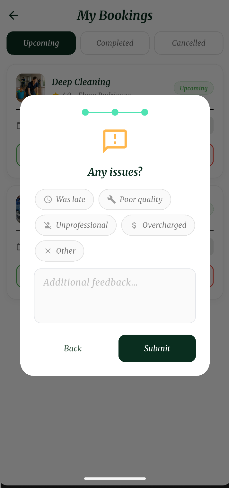</td>
      <td>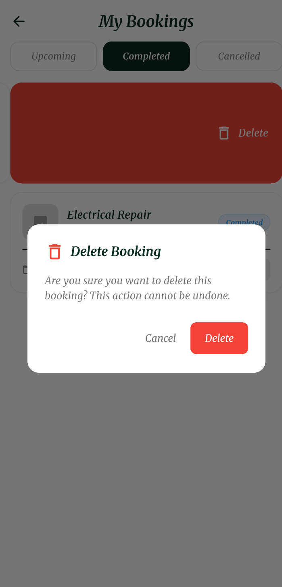</td>
      <td>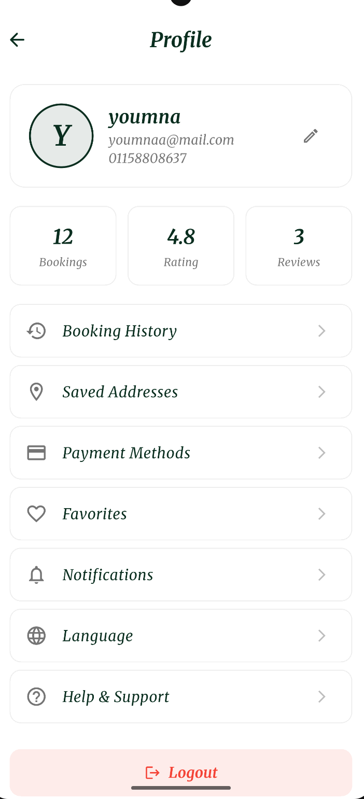</td>
    </tr>
  </table>
</div>

## 🎥 Video Demo

Watch a full walkthrough of the app in action:

▶️ [Watch Demo Video](https://drive.google.com/file/d/1bIblAu1Wh8OObI53C45e_w4QCZtmfJlF/view?usp=sharing)

---

## ✨ Features

### 🎯 Core Features

| Feature | Description |
|---------|-------------|
| **Browse Services** | Explore services by category (Cleaning, Maintenance, Moving, Security, Outdoor, Finishing) |
| **Service Details** | View detailed information, pricing, duration, and provider ratings |
| **Book Now** | Seamless booking flow with date/time selection using an analog clock picker |
| **Booking Confirmation** | Instant confirmation with booking ID and transaction details |
| **Booking Management** | Track upcoming, completed, and cancelled bookings with swipe-to-delete |
| **Address Management** | Add, edit, and save service addresses |
| **Special Instructions** | Add notes for service providers |
| **Order Summary** | Clear breakdown of costs with total amount |

### 🎨 UI/UX Features

| Feature | Description |
|---------|-------------|
| **Glassmorphism Design** | Modern glass-effect cards |
| **Neon Effects** | Beautiful glowing elements in dark mode |
| **Dark/Light Theme** | Full support with a smooth toggle experience |
| **Responsive Layout** | Works on all screen sizes |
| **Custom Animations** | Smooth transitions and interactions throughout |
| **Custom Font** | Unique typography for brand identity |
| **SVG Icons** | High-quality icons for all categories |

### 🔧 Technical Features

| Feature | Description |
|---------|-------------|
| **Clean Architecture** | Feature-first structure with clear separation of concerns |
| **BLoC/Cubit Pattern** | Predictable, testable state management |
| **Custom Painter** | Analog clock widget for time selection |
| **Swipe to Delete** | Dismissible bookings with undo functionality |
| **Rating System** | Multi-step rating dialog for completed bookings |
| **Cross-Platform** | Android & iOS support |
| **Centralized Routing** | Organized navigation via `AppRoutes` / `AppRouter` |

### 📱 Screen-by-Screen Highlights

<details>
<summary><b>🏠 Home Screen</b></summary>

- Hero section with welcome image
- Categories grid
- Customer reviews section
- Dark/Light mode toggle
</details>

<details>
<summary><b>🔍 Service Listing Screen</b></summary>

- Services grouped by category
- Live search bar
- Filter chips
- Glassmorphism service cards
- Empty-state handling
</details>

<details>
<summary><b>📄 Service Details Screen</b></summary>

- Full service details
- Tabs (Description, Included, Reviews)
- Stats row (Rating, Duration, Price)
- Sticky bottom bar with Book Now button
</details>

<details>
<summary><b>📝 Booking Screen</b></summary>

- Service summary card with image and price
- Interactive calendar date picker
- Analog clock time picker
- Address management (add/edit)
- Special notes field for the provider
- Order summary with cost breakdown
- Fixed bottom sheet with total amount + Confirm button
</details>

<details>
<summary><b>✅ Booking Confirmed Screen</b></summary>

- Success animation (Lottie)
- Confirmation message
- Full booking details (ID, date, time, address)
- Provider info (name and rating)
- Amount paid and transaction ID
- Back to Home button
</details>

<details>
<summary><b>📚 My Bookings Screen</b></summary>

- Tabbed interface (Upcoming, Completed, Cancelled)
- Booking cards with provider info
- Swipe-to-delete for completed/cancelled bookings
- Rating dialog with multi-step flow
- Undo delete functionality
</details>

### 🎨 Theme & Colors

| Mode | Palette |
|------|---------|
| ☀️ **Light** | Warm, natural colors · white background · translucent glass cards |
| 🌙 **Dark** | Deep black background (`#0A0A0A`) · neon accent (`#4FE3B2`) · glowing highlights |

---

## 🛠️ Tech Stack

| Technology | Version |
|------------|---------|
| Flutter | ^3.11.4 |
| Dart | ^3.11.4 |
| flutter_bloc | ^8.1.3 |
| iconsax_flutter | ^1.0.0 |
| flutter_svg | ^2.2.1 |
| lottie | ^2.0.0 |
| cupertino_icons | ^1.0.8 |

---

## 📂 Project Structure

<details>
<summary><b>Click to expand</b></summary>

```
lib/
├── main.dart
├── firebase_options.dart
│
├── core/
│   ├── cubit/
│   │   ├── theme_cubit.dart
│   │   └── theme_state.dart
│   └── theme/
│       ├── app_colors.dart
│       ├── app_text_styles.dart
│       ├── app_theme.dart
│       └── dark_app_colors.dart
│
├── data/
│   ├── categories_data.dart
│   ├── categories_items_data.dart
│   ├── how_it_works_data.dart
│   ├── reviews_data.dart
│   └── technicians_data.dart
│
├── models/
│   ├── booking_confirmation_model.dart
│   ├── booking_history_model.dart
│   ├── booking_model.dart
│   ├── category_item_model.dart
│   ├── category_model.dart
│   ├── how_it_works_step.dart
│   ├── payment_method.dart
│   ├── review_model.dart
│   ├── service_model.dart
│   ├── technician_model.dart
│   └── user_model.dart
│
├── routes/
│   ├── app_routes.dart
│   └── app_router.dart
│
├── widgets/
│   ├── custom_app_bar.dart
│   ├── custom_bottom_nav.dart
│   └── custom_button.dart
│
└── features/
    ├── Splash/
    ├── onboarding/
    ├── Auth/
    ├── home/
    ├── explore/
    ├── service_listing/
    ├── service_details/
    ├── book_now/
    ├── booking_confirmed/
    ├── bookings/
    ├── location/
    ├── how_it_works/
    ├── profile/
    └── offers/
```
</details>

---

## 🛠️ Customize Demo Data

All static data is located in `lib/data/`. You can easily modify or add new services, technicians, reviews, and categories.

### 📂 Data Files

| File | Purpose |
|------|---------|
| `categories_data.dart` | Categories and their services |
| `technicians_data.dart` | Service providers |
| `reviews_data.dart` | Customer reviews |
| `how_it_works_data.dart` | Onboarding tutorial steps |

---

### ➕ Add a New Service

1. Open `lib/data/categories_data.dart`
2. Find your category (e.g., `cleaningServices`)
3. Add a new service:

```dart
final newService = ServiceModel(
  id: 's100',
  name: 'Premium Cleaning',
  subtitle: 'Deep cleaning service',
  description: 'Full description here...',
  image: 'assets/images/services/cleaning/premium.png',
  price: 'Starting from 300 EGP',
  rating: 4.9,
  duration: '3 Hours',
  categoryId: 'cleaning',
  about: 'About the service...',
  specialistName: 'Ahmed Hassan',
  specialistTitle: 'CLEANING EXPERT',
  specialistRating: 4.9,
  reviewsCount: 150,
  keyPoints: ['Key point 1', 'Key point 2'],
  included: [
    {'title': 'Service 1', 'description': 'Description 1'},
  ],
  statIcon: Icons.cleaning_services,
  statLabel: 'Eco-Friendly',
);

cleaningServices.add(newService);
```

---

### ➕ Add a New Technician

1. Open `lib/data/technicians_data.dart`
2. Add a new technician:

```dart
final newTech = TechnicianModel(
  id: 't10',
  name: 'Mohamed Ali',
  photo: 'assets/images/technicians/mohamed.png',
  rating: 4.8,
  completedJobs: 320,
  specialty: 'Plumbing Expert',
);

techniciansData.add(newTech);
```

---

### ➕ Add a New Review

1. Open `lib/data/reviews_data.dart`
2. Add a new review:

```dart
final newReview = ReviewModel(
  name: 'Sara Ahmed',
  image: 'assets/images/user4.png',
  rating: 5.0,
  comment: 'Amazing service! Highly recommended.',
);

reviews.add(newReview);
```

---

### ➕ Add a New Category

1. Open `lib/data/categories_data.dart`
2. Add a new category with its services:

```dart
final newServices = [
  // Add services here
];

categories.add(
  CategoryModel(
    id: 'new_category',
    title: 'New Category',
    heroImage: 'assets/images/categories/new_category_hero.png',
    services: newServices,
  ),
);
```

---

### 🖼️ Image Guidelines

| Type | Location | Size |
|------|----------|------|
| Service | `assets/images/services/category/` | 500x500 |
| Technician | `assets/images/technicians/` | 200x200 |
| Category | `assets/images/categories/` | 800x400 |
| User Avatar | `assets/images/` | 100x100 |

---

### 🔄 After Changes

```bash
flutter clean
flutter pub get
flutter run
```

### ⚠️ Important

- ✅ Use **unique IDs** for all new items
- ✅ Follow the **same data structure** as existing items
- ✅ Image paths must match actual file locations
- ✅ Changes reflect immediately with hot reload

---

## 📞 Contact

- **Developer**: Youmna Khaled Youssef
- **LinkedIn**: [Youmna Khaled](https://www.linkedin.com/in/youmna-khaled-869251375)
- **GitHub**: [@Youmnakhaled20](https://github.com/Youmnakhaled20)

---

<p align="center">
  Made with ❤️ by <a href="https://www.linkedin.com/in/youmna-khaled-869251375">Youmna Khaled Youssef</a>
  <br>
  ⭐ Don't forget to star this repository!
</p>
```
